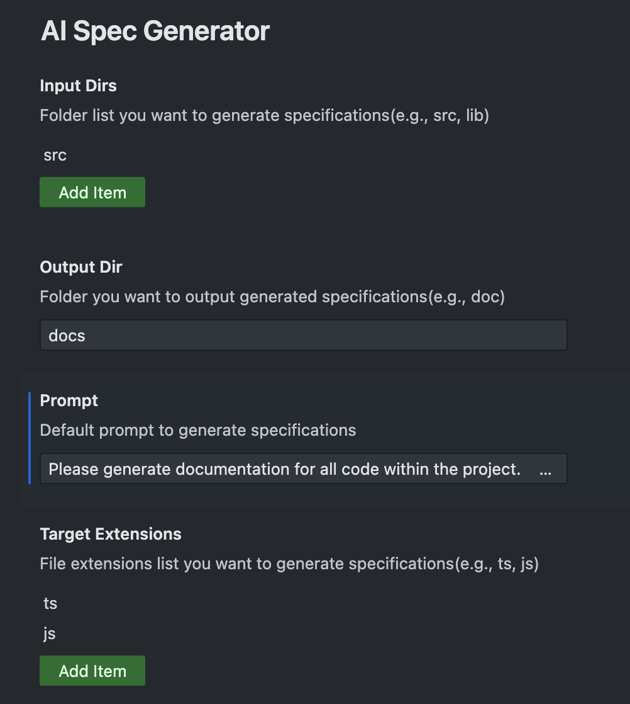
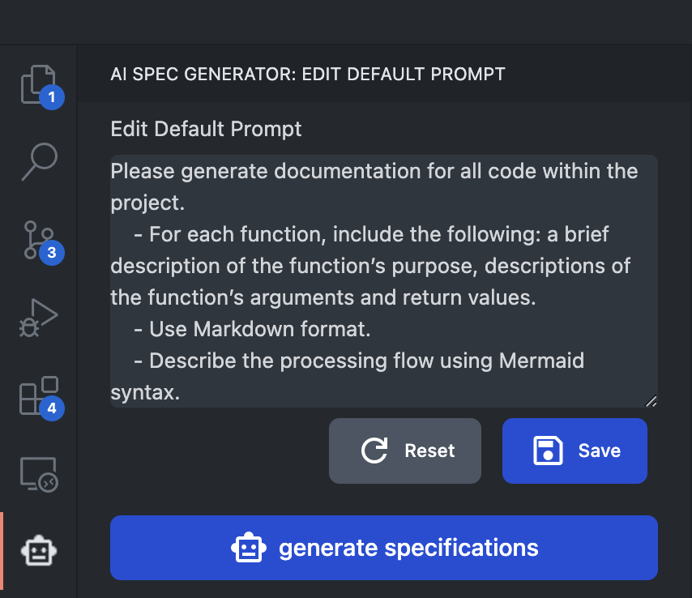
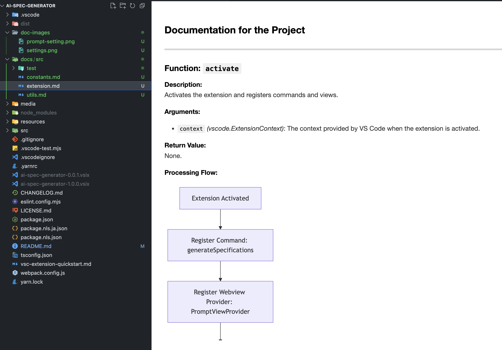

# ai-spec-generator README

## Features

Generate specifications for your code using AI.

## Extension Settings

Before using the extension, please configure the following settings:

- `targetExtensions`
- `inputDirs`
- `outputDir`

You can also edit the initial prompt from the sidebar.  
Click the extension icon to open the input area.

## How to Use

Once all settings are configured, you can generate specifications by:

- Running the `generateSpecifications` command, or
- Clicking the "Generate" button in the sidebar

Then, the specification document will be generated like this.

**Enjoy!**

---

## 機能

AI を使ってコードの仕様書を生成します。

拡張機能の設定
この拡張機能を使用する前に、以下の設定を行ってください：

- targetExtensions(解析対象コードの拡張子)
- inputDirs(解析対象フォルダ)
- outputDir(生成した仕様書の出力フォルダ)

サイドバーから初期プロンプトも編集できます。
拡張機能のアイコンをクリックすると、入力エリアが表示されます。

## 使い方

すべての設定が完了したら、以下のいずれかの方法で仕様書を生成できます：

- generateSpecifications コマンドを実行する
- または、サイドバーの「Generate」ボタンをクリックする

すると、このように仕様書が生成されます。

